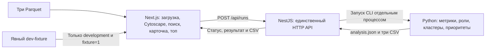

# Money Graph — frontend

Next.js App Router + TypeScript + Cytoscape.js. Интерфейс получает готовые результаты от единственного API NestJS; роли, метрики, кластеры, приоритеты, объяснения и CSV вычисляет Python. Контракт находится в [docs/CONTRACTS.md](../../docs/CONTRACTS.md), установка всего проекта — в [корневом README](../../README.md).



Frontend потребляет контракт статуса, результата и экспортов NestJS. Backend и Python объединены и проверены на реальных данных; Next.js не выполняет их расчёты. Fixture проверяет только отображение и взаимодействие. На 23.09.2026 прошли 51 frontend-тест, типы, Docker-сборка и 7 Chromium end-to-end сценариев production-сборки на настоящих Parquet: 2 248 узлов / 3 119 рёбер / 107 кластеров / топ-20, точный поиск/карточки/направления, скачивание CSV, ошибки и retry. Стенд Родиона не использует fixture или перехваты API; [команда и результаты](../../docs/ACCEPTANCE.md). Отдельный реальный браузерный прогон Ерасыла описан в [отчёте интеграции](../../docs/BACKEND_VERIFICATION.md). Объяснение трёх gid человеком за минуту и воспроизведение итоговой ревизии другим участником остаются ручной приёмкой.

Этот отчёт фиксирует версию до объединения новой навигации и восстановления после F5. Результаты конкретных ревизий приведены в отчёте приёмки; изменения интерфейса ниже требуют повторной сквозной проверки объединённой версии.

## Локальный запуск

Из корня репозитория, с Node.js 24 LTS и npm 11:

```sh
npm ci
npm run build:contracts
npm run dev:api
```

Во втором терминале из того же корня:

```sh
npm run dev:web
```

Открыть `http://localhost:3000`. Адрес API по умолчанию — `http://localhost:3001/api`. Для другого адреса задать `NEXT_PUBLIC_API_URL` до запуска Next.js; для production после его изменения нужна повторная сборка. Настройку CORS и `WEB_ORIGIN` выполняет backend согласно корневому README. В браузере адрес API должен быть доступен пользователю, Docker-имя сервиса `api` здесь не подходит.

## Основной сценарий для передачи Ерасылу

1. Выбрать `nodes.parquet`, `edges.parquet` и `transactions.parquet` в соответствующих полях. Frontend отправляет их одним multipart-запросом `POST /api/runs` в полях `nodes`, `edges`, `transactions`; расширение проверяется на клиенте, содержимое Parquet проверяется backend и Python.
2. Запустить расчёт. Интерфейс показывает состояние и прошедшее время без вымышленного процента готовности. После `completed` один снимок результата используется для графа, таблицы и карточки узла.
3. Открыть направленный граф, свериться с легендой всех шести ролей и кластеров. Выбрать кластер, чтобы рассмотреть его внутренние связи; «Весь граф» возвращает обзор, «Вписать» восстанавливает видимую область. Изолированные узлы также присутствуют. Раскладка не является аналитическим выводом.
4. Найти точный `gid` или выбрать узел на графе/в таблице приоритетов. Режим «Связи узла» показывает выбранный узел и его непосредственных контрагентов, включая связи с другими кластерами. Справа — карточка с ролью, двумя разными оценками, `evidence`, ограничениями, метриками и переводами. Выбор связанного узла продолжает разбор; повторный поиск того же gid возвращает к нему камеру.
5. Просмотреть сведения кластера и минимум 20 строк `top_nodes`, когда API вернул такой список. Порядок и `why` приходят от аналитики; frontend их не рассчитывает.
6. Скачать `nodes_roles.csv`, `clusters.csv`, `top_nodes.csv` через NestJS. Файлы создаёт Python; frontend не генерирует CSV и не инициирует повторный анализ при скачивании.
7. Начать следующий запуск. Результаты, выбор узла и асинхронные запросы предыдущего запуска не должны попадать в новый.

Реальные API-ошибки отображаются явно; они не заменяются синтетическим результатом. Работа `/api/health` сама по себе не означает успешность расчёта. В объединённой ветке `/api/runs` выполняет настоящий pipeline, а frontend не зависит от старого поля `health.analytics`.

«На весь экран» разворачивает граф вместе с поиском, фильтрами, легендой и карточкой на всё окно браузера. «Свернуть» или Esc возвращает прежнюю прокрутку страницы и фокус. Экземпляр Cytoscape, выбранный узел и масштаб сохраняются. На узком экране карточка находится под графом. После расчёта блок файлов сворачивается; «Изменить файлы» открывает его для следующего запуска. Объяснения в таблице раскрываются по нажатию.

Обзор размещает узлы внутри готовых кластеров API детерминированно, без итерационной физической симуляции. Компактное расположение соседей рассчитывается только при явном выборе узла; возврат к обзору восстанавливает исходные координаты. Ввод текста, раскрытие объяснений и fullscreen не пересоздают граф и не запускают раскладку. Фильтры скрывают элементы, сохраняя полный набор и возможность поиска любого gid. Все цвета используют общие токены XI.

## Восстановление после перезагрузки

После принятия файлов сервером (`202`) frontend сохраняет `run_id` в адресе страницы (`?run=…`) и последний запуск в `localStorage`, отдельно для каждого адреса API. После F5 страница запрашивает прежний статус и результат через GET, без повторной отправки Parquet и нового расчёта. Если расчёт ещё выполняется, опрос продолжается. Граф, карточки, приоритеты и три CSV используют результат того же запуска; выбранный `gid` сохраняется в адресе строкой без потери точности. Поля выбора файлов после F5 пустые, но повторно заполнять их для текущего анализа не нужно.

При открытии `/` восстанавливается последний запуск этого браузера. Явный `?run=…` имеет приоритет, поэтому вкладки с разными запусками не переключают друг друга. Новый набор заменяет сохранённый запуск только после принятия сервером: отклонённая загрузка не теряет прежнюю ссылку. «Новый анализ» открывает пустую форму и убирает сохранённую ссылку; серверные файлы не удаляются. «Прекратить ожидание» также закрывает текущий запуск в интерфейсе, не останавливая серверный расчёт.

В браузере сохраняются только идентификаторы, без Parquet, денежных данных и копии результата. При запрете `localStorage` восстановление по адресу продолжает работать. Временная ошибка API оставляет возможность повторить получение. Ответ `404` показывает, что запуск недоступен, и убирает устаревшую ссылку; fixture никогда не подменяет эту ошибку и не заменяет сохранённый реальный запуск.

Граница восстановления — уже принятый API запуск. Ещё не отправленные файлы или загрузка, для которой браузер не успел получить `202`, не восстанавливаются. Текущий NestJS держит индекс запусков в памяти: после перезапуска **API** прежний `run_id` недоступен, даже если файлы остались в `runs/`. Обычная перезагрузка страницы или перезапуск только web этого ограничения не затрагивает. Фильтры, масштаб, прокрутка и fullscreen не сохраняются между перезагрузками.

## Явный dev-fixture

Для независимой проверки интерфейса запустить `npm run dev:web`, открыть `http://localhost:3000/?fixture=1` и нажать «Запустить dev-fixture». Режим включается только при `NODE_ENV=development` и явно обозначается в интерфейсе. Обычная страница `/` работает с реальным API. Production-сборка не включает режим fixture по query-параметру.

[lib/dev-fixture.ts](lib/dev-fixture.ts) содержит статический синтетический снимок по текущему контракту: 24 узла, 21 направленное ребро, четыре кластера, все шесть ролей и 20 приоритетных строк. Метрики и оценки вручную заданы как тестовые входы; это не аналитические правила и не результаты обработки выбранных файлов. Все `gid` и KZT хранятся строками, включая значения за пределами точности JavaScript `Number`.

Узлы для проверки:

| Случай | `gid` |
| :--- | :--- |
| Seed, coordinator, исходящие связи | `9007199254740993` |
| Глубина 4, входящая связь | `9007199254740999` |
| Изолированный seed, максимальный int64, вне топа | `9223372036854775807` |
| Узел вне топа со связью | `9007199254741015` |
| Отсутствующий идентификатор | `123456789` |

На первой связи сумма равна точно `9007199254740993.01` KZT. Её отображение должно сохранять последние цифры и дробную часть. Для изолята отношение исходящего к входящему обороту — `null`, а не ноль. Для узла глубины 4 выводится ограничение границы выборки.

Fixture не читает Parquet, не запускает Python и не создаёт CSV. Три скачивания в этом режиме недоступны с объяснением; их работоспособность проверяется только через API. Для выхода из режима открыть `/` без `fixture=1`.

## Проверки

Из корня репозитория:

```sh
npm run team:check
npm run check:structure
npm run build:contracts
node --import tsx --test apps/web/tests/*.test.ts
npm run typecheck --workspace @money-graph/web
npm run build --workspace @money-graph/web
```

Тесты fixture проверяют точные идентификаторы, покрытие ролей, сохранение изолированного seed, depth=4, согласованность кластеров и 20 строк приоритетов. Они не проверяют правильность аналитических гипотез.

Автоматическая проверка браузера использует установленный Python Playwright и Chrome, запущенный `npm run dev:web` и явные перехваты ответов API внутри страницы. Она не запускает собственный сервер и не обращается к настоящей аналитике. Подготовить тестовый JSON и запустить из корня:

```sh
node --import tsx -e "const fs = require('node:fs'); const { fixtureResult } = require('./apps/web/lib/dev-fixture.ts'); fs.mkdirSync('./apps/web/.test-artifacts', { recursive: true }); fs.writeFileSync('./apps/web/.test-artifacts/fixture.json', JSON.stringify(fixtureResult));"
python apps/web/tests/browser_smoke.py
python apps/web/tests/browser_reload.py
```

Для проверки большого графа задать `ANALYSIS_JSON` — путь к существующему локальному `analysis.json`, затем выполнить `python apps/web/tests/browser_scale.py`. Скрипт воспроизводит этот снимок через перехват ответа API и измеряет только frontend; данные не генерируются и не копируются в исходники.

Для другого адреса web задать `WEB_URL`, для другого установленного Chromium-канала — `BROWSER_CHANNEL`. Скрипт проверяет fixture, точный поиск, фактические элементы Cytoscape и отсутствие повторной раскладки, неполные/ошибочные файлы, успешный контракт API, остановку опроса, три скачивания, 501 без подмены fixture, неудачный расчёт, некорректный ответ, пустой результат и смену запуска с отменой старого запроса. Снимки экрана, JSON-отчёт и тестовые CSV сохраняются в игнорируемом `.test-artifacts/`. Скачанные в этой проверке байты синтетические: проверяется механизм скачивания, а не содержание CSV аналитики.

Фактически проверено 23.09.2026: 70 frontend unit-тестов прошли на Node.js 24.21.0. Они включают точные ID и суммы, сохранение изолятов, воспроизводимость координат при перестановке входных данных, отсутствие наложения маркеров, компактный вид входящих/исходящих/двусторонних связей и 15 проверок восстановления ссылки на запуск. Прошли общая проверка типов, production-сборка Docker, `team:check`, `check:structure` и `git diff --check`.

Семь сценариев `browser_smoke.py` прошли в Chrome 153: fixture, успешный контракт API со скачиваниями, 501, неуспешный расчёт, некорректный ответ, пустой результат и смена запуска. Проверены ширины 1440 и 390 px, fullscreen и Esc, возврат прокрутки/фокуса, блокировка фона, сохранение камеры и экземпляра графа, повторный поиск того же gid, фильтрация с поиском скрытого изолята и восстановление обзора. Это синтетические ответы; они проверяют UI и обработку ошибок, а не расчёты аналитики.

Все 14 сценариев `browser_reload.py` прошли: готовый/активный/неудачный запуск после F5, точный выбранный gid, три скачивания, повтор после сетевой ошибки, очистка ссылки при 404, принятая и отклонённая замена файлов, повреждённый/запрещённый storage, приоритет URL, разные адреса API, некорректная ссылка, изоляция fixture и «Новый анализ». После восстановления на 390 px нет горизонтального переполнения; ошибок JavaScript и гидратации нет. Это явные перехваты API по контракту; они проверяют поведение интерфейса. Отчёт — `.test-artifacts/reload-results.json`.

`browser_scale.py` проверил существующий локальный снимок 2 248 узлов / 3 119 рёбер через перехват ответа API. Все элементы сохранены; проверены фильтры, поиск, fullscreen, устойчивость камеры и размещение видимых соседей вместе с подписями внутри холста. Результат с фактическими временами находится в `.test-artifacts/scale-results.json`. Это проверка отрисовки, без нового расчёта Python.

Для отдельной проверки настоящего pipeline задать `INPUT_DIR` — каталог существующих трёх Parquet, оставить запущенными web и API и выполнить:

```sh
python apps/web/tests/browser_pipeline.py
```

Например, в PowerShell: `$env:INPUT_DIR = (Resolve-Path 'runs/<run-id>/input').Path`. Для чтения исходного множества gid нужен PyArrow в текущем Python либо запущенный контейнер `api`; во втором случае входы должны находиться под смонтированным `runs/`. Скрипт не перехватывает API, не создаёт fixture, проверяет исходные gid против API/Cytoscape, карточки и приоритеты против экрана, а все строки трёх скачанных CSV — против API. Файлы, снимки экрана и `production-pipeline-results.json` остаются только в игнорируемом `.test-artifacts/`.

На локальных Parquet 2 248 / 3 119 / 4 840 полный браузерный сценарий через NestJS и Python прошёл: все исходные gid сохранились; CSV содержали 2 248 / 107 / 20 строк данных и совпали с API. Карточки изолированного seed, узла глубины 4 и связанного узла совпали с результатом, включая точные денежные строки. Первый замер после переработки UI: отправка файлов → готовый граф 4 477 мс, API 1 856 мс, Python `metadata.elapsed_ms` 295,897 мс. Границы этих измерений различаются; это единичный локальный замер с браузерной автоматизацией, без гарантии для другой машины. Необработанных JavaScript-ошибок нет.

После добавления восстановления тот же настоящий pipeline повторно прошёл с F5: прежний `run_id`, выбранный `gid`, все 2 248 узлов / 3 119 рёбер и топ-20 восстановились без дополнительного POST. Все три CSV после перезагрузки побайтно совпали с первоначальными скачиваниями и прошли сверку с API. В этом локальном замере восстановление до готового графа заняло 1 334 мс; ошибок JavaScript и console не было. `browser_pipeline.py` включает эти проверки и сохраняет результат в `production-pipeline-results.json`.

## Интеграция и границы проверки

- API и аналитика объединены; реальные входы, сохранение всех gid, три CSV и время менее 300 секунд проверены отдельно от браузера в [отчёте интеграции](../../docs/BACKEND_VERIFICATION.md). Правила и ограничения — в [методологии](../../docs/METHODOLOGY.md).
- Браузерная приёмка на доступных локальных Parquet выполнена отдельно от fixture. Она подтверждает целостность передачи и отображения данных; правильность ролей и гипотез оценивается по методологии аналитики.
- Отдельная браузерная приёмка Ерасыла пройдена 23.09.2026 через Docker web/API: загрузка → граф → поиск обычного узла, изолята и depth=4 → карточки → три скачивания. Полное множество узлов и рёбер, поля карточек и все CSV сверены с настоящим результатом Python. Три автоматических поиска в том прогоне заняли 1 459 ms; это не замер скорости работы человека и не замер нового интерфейса выше. Подробности и ограничения — в [отчёте](../../docs/BACKEND_VERIFICATION.md), подготовка повторного показа — в [DEMO.md](../../docs/DEMO.md).
- Проверка frontend опирается на локальные `TEAM_PLAN.md`, `CONTRACTS.md` и промпт Ильи. Исходное ТЗ в Google Docs не удалось открыть инструментом доступа; повторная сверка с полным оригиналом остаётся непроверенной.

## Пятиминутная репетиция

- 0:00–1:00 — Ерасыл запускает независимый Python CLI на выданных Parquet, показывает фактическое время и три CSV. Это шаг приёмки команды, fixture его не заменяет.
- 1:00–2:00 — показать тот же набор через загрузку в интерфейсе, статус и готовый направленный граф.
- 2:00–3:00 — найти три произвольных `gid` за минуту, включая изолят и глубину 4; показать роль, объяснение, связи и ограничения.
- 3:00–4:00 — выбрать строку топа, разобрать отличие `role_score` от `priority_score`, открыть сведения кластера как гипотезу.
- 4:00–5:00 — скачать три CSV и сверить строки с интерфейсом. Проговорить границу выборки и неполные входящие потоки seeds.

Настоящий pipeline доступен и проверен через браузер на локальных Parquet. Совместную репетицию проводить на том же наборе, который команда предъявляет для приёмки; fixture её не заменяет.
