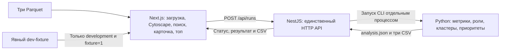

# Money Graph — frontend

Next.js App Router + TypeScript + Cytoscape.js. Интерфейс получает готовые результаты от единственного API NestJS; роли, метрики, кластеры, приоритеты, объяснения и CSV вычисляет Python. Контракт находится в [docs/CONTRACTS.md](../../docs/CONTRACTS.md), установка всего проекта — в [корневом README](../../README.md).



Frontend потребляет контракт статуса, результата и экспортов NestJS. Backend и Python объединены и проверены на реальных данных; Next.js не выполняет их расчёты. Fixture проверяет только отображение и взаимодействие. После слияния 23.09.2026 прошли 51 frontend-тест, общая проверка типов и Docker-сборка. Валидатор интерфейса принимает реальный снимок 2 248 узлов / 3 119 рёбер / 107 кластеров / топ-20. Сквозной браузерный сценарий на настоящих Parquet пройден 23.09.2026; результаты и границы проверки — в [отчёте интеграции](../../docs/BACKEND_VERIFICATION.md).

## Локальный запуск

Из корня репозитория, с Node.js 24 LTS и npm 11:

```sh
npm ci
npm run build:contracts
npm run dev:api
```

Во втором терминале из того же корня:

```sh
npm run dev:web
```

Открыть `http://localhost:3000`. Адрес API по умолчанию — `http://localhost:3001/api`. Для другого адреса задать `NEXT_PUBLIC_API_URL` до запуска Next.js; для production после его изменения нужна повторная сборка. Настройку CORS и `WEB_ORIGIN` выполняет backend согласно корневому README. В браузере адрес API должен быть доступен пользователю, Docker-имя сервиса `api` здесь не подходит.

## Основной сценарий для передачи Ерасылу

1. Выбрать `nodes.parquet`, `edges.parquet` и `transactions.parquet` в соответствующих полях. Frontend отправляет их одним multipart-запросом `POST /api/runs` в полях `nodes`, `edges`, `transactions`; расширение проверяется на клиенте, содержимое Parquet проверяется backend и Python.
2. Запустить расчёт. Интерфейс показывает состояние и прошедшее время без вымышленного процента готовности. После `completed` один снимок результата используется для графа, таблицы и карточки узла.
3. Открыть направленный граф, свериться с легендой всех шести ролей и кластеров. Изолированные узлы также присутствуют. Раскладка не является аналитическим выводом.
4. Найти точный `gid` или выбрать узел на графе/в таблице приоритетов. Открывается та же карточка с ролью, двумя разными оценками, `evidence`, ограничениями, метриками, входящими и исходящими связями. Выбор связанного узла продолжает разбор.
5. Просмотреть сведения кластера и минимум 20 строк `top_nodes`, когда API вернул такой список. Порядок и `why` приходят от аналитики; frontend их не рассчитывает.
6. Скачать `nodes_roles.csv`, `clusters.csv`, `top_nodes.csv` через NestJS. Файлы создаёт Python; frontend не генерирует CSV и не инициирует повторный анализ при скачивании.
7. Начать следующий запуск. Результаты, выбор узла и асинхронные запросы предыдущего запуска не должны попадать в новый.

Реальные API-ошибки отображаются явно; они не заменяются синтетическим результатом. Работа `/api/health` сама по себе не означает успешность расчёта. В объединённой ветке `/api/runs` выполняет настоящий pipeline, а frontend не зависит от старого поля `health.analytics`.

## Явный dev-fixture

Для независимой проверки интерфейса запустить `npm run dev:web`, открыть `http://localhost:3000/?fixture=1` и нажать «Запустить dev-fixture». Режим включается только при `NODE_ENV=development` и явно обозначается в интерфейсе. Обычная страница `/` работает с реальным API. Production-сборка не включает режим fixture по query-параметру.

[lib/dev-fixture.ts](lib/dev-fixture.ts) содержит статический синтетический снимок по текущему контракту: 24 узла, 21 направленное ребро, четыре кластера, все шесть ролей и 20 приоритетных строк. Метрики и оценки вручную заданы как тестовые входы; это не аналитические правила и не результаты обработки выбранных файлов. Все `gid` и KZT хранятся строками, включая значения за пределами точности JavaScript `Number`.

Узлы для проверки:

| Случай | `gid` |
| :--- | :--- |
| Seed, coordinator, исходящие связи | `9007199254740993` |
| Глубина 4, входящая связь | `9007199254740999` |
| Изолированный seed, максимальный int64, вне топа | `9223372036854775807` |
| Узел вне топа со связью | `9007199254741015` |
| Отсутствующий идентификатор | `123456789` |

На первой связи сумма равна точно `9007199254740993.01` KZT. Её отображение должно сохранять последние цифры и дробную часть. Для изолята отношение исходящего к входящему обороту — `null`, а не ноль. Для узла глубины 4 выводится ограничение границы выборки.

Fixture не читает Parquet, не запускает Python и не создаёт CSV. Три скачивания в этом режиме недоступны с объяснением; их работоспособность проверяется только через API. Для выхода из режима открыть `/` без `fixture=1`.

## Проверки

Из корня репозитория:

```sh
npm run team:check
npm run check:structure
npm run build:contracts
node --import tsx --test apps/web/tests/*.test.ts
npm run typecheck --workspace @money-graph/web
npm run build --workspace @money-graph/web
```

Тесты fixture проверяют точные идентификаторы, покрытие ролей, сохранение изолированного seed, depth=4, согласованность кластеров и 20 строк приоритетов. Они не проверяют правильность аналитических гипотез.

Автоматическая проверка браузера использует установленный Python Playwright и Chrome, запущенный `npm run dev:web` и явные перехваты ответов API внутри страницы. Она не запускает собственный сервер и не обращается к настоящей аналитике. Подготовить тестовый JSON и запустить из корня:

```sh
node --import tsx -e "const fs = require('node:fs'); const { fixtureResult } = require('./apps/web/lib/dev-fixture.ts'); fs.writeFileSync('./apps/web/.test-artifacts/fixture.json', JSON.stringify(fixtureResult));"
python apps/web/tests/browser_smoke.py
python apps/web/tests/browser_scale.py
```

Для другого адреса web задать `WEB_URL`, для другого установленного Chromium-канала — `BROWSER_CHANNEL`. Скрипт проверяет fixture, точный поиск, фактические элементы Cytoscape и отсутствие повторной раскладки, неполные/ошибочные файлы, успешный контракт API, остановку опроса, три скачивания, 501 без подмены fixture, неудачный расчёт, некорректный ответ, пустой результат и смену запуска с отменой старого запроса. Снимки экрана, JSON-отчёт и тестовые CSV сохраняются в игнорируемом `.test-artifacts/`. Скачанные в этой проверке байты синтетические: проверяется механизм скачивания, а не содержание CSV аналитики.

Фактически проверено 23.09.2026: все 51 frontend unit-тест прошли на Node.js 24.21.0, включая два теста fixture; семь браузерных сценариев прошли в Chrome 153.0.8010.53 без необработанных JavaScript-ошибок. Проверены ширины 1440 и 390 px, отсутствие горизонтального переполнения страницы, 24 узла и 21 ребро внутри Cytoscape, 20 строк таблицы и сохранение экземпляра/позиций графа при поиске и выборе. Браузерная проверка покрыла fixture, успешный контракт API со скачиванием, 501, неуспешный расчёт, некорректный ответ, пустой результат и смену запуска. Она использовала fixture и перехваченные ответы API. Реальный расчёт Parquet и содержание трёх CSV аналитики этими результатами не подтверждены.

Историческая проверка Ильи до слияния backend: настоящий NestJS на `POST /api/runs` возвращал HTTP 501, его сообщение отображалось, граф и fixture не появлялись. Это не текущее состояние объединённого API. Production-сборка успешно проверена с `?fixture=1`: синтетический режим не включается. Production-сборка frontend, общая проверка типов `npm run typecheck`, `team:check`, `check:structure` и `git diff --check` прошли. Системный Node был версии 22; финальная сборка и unit-тесты выполнялись через Node.js 24.21.0 из временного кеша npm, без изменения lockfile или системной установки.

`browser_scale.py` отдельно передал браузеру синтетический снимок из 2 248 узлов и 3 119 рёбер. В Chrome 153, Windows, viewport 1440×1000, от ответа `/result` до готового графа и двух кадров отрисовки измерено 2 133 мс; поиск изолированного `9223372036854775807` занял 200 мс. Все элементы присутствовали в Cytoscape, необработанных JS-ошибок не было. Это единичный замер с накладными расходами браузерной автоматизации и тестовыми входами; он не измеряет аналитический pipeline, не подтверждает время на реальном датасете и не является гарантией для другой машины. Отчёт сохраняется в `.test-artifacts/scale-results.json`.

Проверить в браузере: неполный комплект файлов, ошибки API, загрузку/выполнение, пустой снимок, граф и легенду, поиск примеров выше, выбор строки таблицы, переход по связи, отсутствие повторной раскладки при вводе поиска и выборе, смену запуска и отсутствие устаревшего ответа. Отдельно проверить узкую ширину экрана и управление клавиатурой. На реальных данных дополнительно пройти полный путь до всех трёх CSV и сверить их с экраном.

## Интеграция и приёмка

- API и аналитика объединены; реальные входы, сохранение всех gid, три CSV и время менее 300 секунд проверены отдельно от браузера в [отчёте интеграции](../../docs/BACKEND_VERIFICATION.md). Правила и ограничения — в [методологии](../../docs/METHODOLOGY.md).
- Браузерная приёмка на исходных Parquet пройдена 23.09.2026 через работающие Docker web/API: загрузка → граф → поиск обычного узла, изолята и depth=4 → карточки → три скачивания. Полное множество узлов и рёбер, поля карточек и все CSV сверены с настоящим результатом Python. Три автоматических поиска заняли 1 459 ms; это не замер скорости работы человека. Подробности и ограничения — в [отчёте](../../docs/BACKEND_VERIFICATION.md), подготовка повторного показа — в [DEMO.md](../../docs/DEMO.md).
- Проверка frontend опирается на локальные `TEAM_PLAN.md`, `CONTRACTS.md` и промпт Ильи. Исходное ТЗ в Google Docs не удалось открыть инструментом доступа; повторная сверка с полным оригиналом остаётся непроверенной.

## Пятиминутная репетиция

- 0:00–1:00 — Ерасыл запускает независимый Python CLI на выданных Parquet, показывает фактическое время и три CSV. Это шаг приёмки команды, fixture его не заменяет.
- 1:00–2:00 — показать тот же набор через загрузку в интерфейсе, статус и готовый направленный граф.
- 2:00–3:00 — найти три произвольных `gid` за минуту, включая изолят и глубину 4; показать роль, объяснение, связи и ограничения.
- 3:00–4:00 — выбрать строку топа, разобрать отличие `role_score` от `priority_score`, открыть сведения кластера как гипотезу.
- 4:00–5:00 — скачать три CSV и сверить строки с интерфейсом. Проговорить границу выборки и неполные входящие потоки seeds.

Настоящий pipeline уже доступен после объединения веток. Провести совместную браузерную репетицию на выданных данных; не заменять её синтетическим fixture или результатом unit-тестов.
