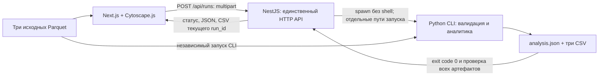

# Money Graph: запуск и пятиминутная демонстрация

Это сценарий подготовки и приёмки, а не отчёт о состоявшейся репетиции. Фактические проверки и границы измерения времени фиксируются в [BACKEND_VERIFICATION.md](BACKEND_VERIFICATION.md). Правила ролей и пороги описаны в [методологии](METHODOLOGY.md), форматы — в [контрактах](CONTRACTS.md).

## Что подготовить заранее

- Рабочий Docker Desktop/Engine с Compose v2 и браузер. Команды выполняются из корня репозитория; установка без Docker описана в [README](../README.md).
- Три настоящих файла организаторов: `data/nodes.parquet`, `data/edges.parquet`, `data/transactions.parquet`. Для нового клона получить их отдельно: данные не хранятся в Git. Перед репетицией проверить, что все три файла доступны локально.
- Свободный выходной каталог, например `artifacts/demo-001`. При повторе выбрать новое имя: готовые результаты CLI не перезаписывает.
- Локальную папку для скачанных CSV вне Git-репозитория. Исходные файлы, `analysis.json`, CSV и снимки экрана с реальными gid не добавлять в Git. Публикация результатов требует отдельного разрешения владельца.

Обновить контейнеры и убедиться, что используется установленная аналитика:

```powershell
docker compose up --build --wait
docker compose ps
docker compose exec api python -m money_graph --check-environment
```

Оба сервиса должны быть healthy, проверка Python — завершиться успешно и сообщить `pipeline_implemented: true`. Сам по себе health API не подтверждает правильность расчёта. Открыть [интерфейс](http://localhost:3000) без `?fixture=1`.

Перед репетицией один раз проверить самостоятельный CLI:

```powershell
docker compose --profile tools run --rm --build analytics --input-dir /data --output-dir /artifacts/demo-001
```

Ожидаются exit code 0 и четыре файла в `artifacts/demo-001/`: `analysis.json`, `nodes_roles.csv`, `clusters.csv`, `top_nodes.csv`. Сервис `analytics` выполняет одну команду и завершается; работающие web/API для этого расчёта не нужны. Сборка образа относится к подготовке и не включается во время аналитического процесса.

Для повторной автоматической приёмки на реальных данных, если локальная `.venv` уже установлена по README:

```powershell
$env:OPENBLAS_NUM_THREADS = '1'
$env:OMP_NUM_THREADS = '1'
$env:PYTHON_BIN = (Resolve-Path .venv/Scripts/python.exe).Path
$env:REAL_DATA_DIR = (Resolve-Path data).Path
$env:MONEY_GRAPH_DATA_DIR = $env:REAL_DATA_DIR
$env:NODE_OPTIONS = '--max-old-space-size=256'
npm run test:dataset --workspace @money-graph/api
.venv/Scripts/python.exe -m unittest discover -s analytics/tests -v
```

`test:dataset` запускает временный HTTP API и настоящий CLI, проверяет полное множество исходных gid, JSON и байты трёх CSV. Он отдельно измеряет процесс Python снаружи и процесс вместе с проверкой backend; оба значения должны быть меньше `300000 ms`. Эта команда не заменяет браузерную приёмку запущенных контейнеров.

## Как выбрать три узла для объяснения

В локальном `analysis.json` нового расчёта выбрать по одному узлу из таблицы. Чтобы выбор можно было повторить, брать минимальный **числовой int64 gid** среди подходящих узлов; сам gid хранить и копировать строкой без преобразования в JavaScript `Number`.

| Случай | Условие выбора | Что объяснить в карточке |
| :--- | :--- | :--- |
| Обычный связанный узел | `is_seed = false`, `depth < 4`, `in_degree + out_degree > 0`; предпочтительно вне `top_nodes` | Роль, evidence, обе оценки, наблюдаемые суммы и переход к контрагенту; поиск работает и вне топа |
| Изолят | `in_degree = 0` и `out_degree = 0` | Узел сохранён; отсутствие связей и неопределённое отношение не выдают за полный баланс |
| Граница выборки | `depth = 4`, другой gid относительно первых двух | Ограничение четвёртого шага; отсутствие исходящих не доказывает удержание средств |

Если обычного узла вне топа нет, выбрать подходящий узел из топа и отметить это в локальных заметках. Если какой-либо случай отсутствует в предоставленном наборе, зафиксировать отсутствие, не подменять его синтетическим примером. Конкретные gid и разбор хранить только локально в `artifacts/` или вне репозитория.

Родион объясняет основания из [методологии](METHODOLOGY.md), Ерасыл проверяет совпадение JSON/CSV, Илья — поиск и карточку. Выбор трёх примеров не заменяет проверки всех исходных gid.

## Показ на пять минут

| Время | Действие | Что должно быть видно |
| :--- | :--- | :--- |
| 0:00–1:00 | Показать схему ниже, выполнить независимый CLI в новом каталоге после `demo-001` | Три входа, успешное завершение, JSON и три CSV. Показать фактический внешний замер из отчёта приёмки, указав его машину и дату |
| 1:00–2:00 | В интерфейсе выбрать «Узлы», «Связи», «Транзакции» и нажать «Запустить расчёт» | Новый run_id, выполнение и «Результат получен»; направленный граф, счётчики и легенда |
| 2:00–3:00 | По очереди найти три подготовленных точных gid | Карточки обычного узла, изолята и depth=4. Роль, evidence, ограничения и суммы согласованы с этим запуском |
| 3:00–4:00 | Открыть узел из «Приоритетные узлы», затем его связь и сведения кластера | Приоритет и `why`, отличие `role_score` от `priority_score`, направление перевода; кластер обозначен как гипотеза |
| 4:00–5:00 | Нажать каждую из трёх кнопок «Скачать CSV», сверить выбранные строки | `nodes_roles.csv`, `clusters.csv`, `top_nodes.csv` получены из текущего run_id; названия, состав и значения соответствуют JSON и экрану |

Для обычного узла сверить точный gid, роль, кластер, evidence и обе оценки в `nodes_roles.csv` и JSON. В интерфейсе оценки округляются до трёх знаков; это формат отображения, исходные CSV/JSON должны сохранять значение. Для строки топа сверить rank, gid, роль, приоритет и why; для кластера — состав, число seeds и точную денежную строку. CSV читать как текст либо импортировать со строковым типом gid: автоматическое преобразование в числовой формат таблицы может потерять разряды.

Если запуск завершился ошибкой, показать её и остановить демонстрацию результата. Старые CSV, fixture или прежний run_id не заменяют успешность текущего расчёта. Диагностика:

```powershell
docker compose logs --tail=100 api web
```

## Схема работающего решения



Python вычисляет метрики, роли, кластеры, приоритеты и экспорты. NestJS разрешает один активный расчёт и публикует только проверенный результат. Интерфейс показывает готовые значения. Раскладка графа не является аналитическим выводом.

## Что фиксировать после репетиции

- Commit проверенного кода, дату, ОС и версии runtime; результаты проверок и фактические границы измеренного интервала.
- Успех загрузки → расчёта → графа → трёх поисков → карточек → скачивания, отсутствие ошибок браузера и совпадение данных текущего запуска. Отметить отдельно всё, что не удалось проверить.
- Время полного процесса от старта Python до завершения записи и проверки файлов; не использовать только `metadata.elapsed_ms`, которое заканчивается до сериализации. Backend `elapsed_ms` дополнительно включает его проверку результатов. Установку, сборку, HTTP-загрузку и отрисовку графа учитывать отдельно.
- Роли и кластеры — гипотезы; `role_score` не является калиброванной вероятностью. Неполные входящие потоки seeds и граница depth=4 не позволяют восстановить полный баланс или доказать удержание средств.
- В публичный отчёт переносить только разрешённые агрегаты и результаты проверок. Датасет, экспорты и содержащие реальные gid материалы остаются локальными; перед commit просмотреть staged diff.

Предыдущая реальная приёмка Ерасыла зафиксировала **2 007 ms на Windows** и **1 927 ms в Docker** для процесса вместе с backend-валидацией. Это исторические измерения из [отчёта](BACKEND_VERIFICATION.md), а не результат новой репетиции и не гарантия времени на другой машине. Отметка о прохождении браузерной приёмки появляется только после фактического выполнения сценария на настоящих Parquet.
