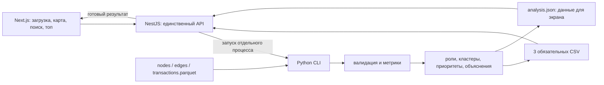

# Money Graph — план команды на 5 часов

Согласовано 23.09.2026. Команда: **Ерасыл — backend; Илья — frontend; Родион — аналитик**.

Источник требований: [ТЗ HackAlem AI](https://docs.google.com/document/d/1JPLU-G6R25Ge2hVaY2J9cqvrx7FGExj87XKwJPaMz3o/edit?tab=t.2mrm4atu16r8). Схемы файлов уточняются по README предоставленного датасета. Подготовлен общий каркас и Docker-запуск; Python CLI реализован и отдельно проверен, HTTP/UI-интеграция остаётся задачей команды. Ниже сохранён план ответственности и приёмки, а не отметка о выполнении всех пунктов. Актуальное состояние и команды — в корневом README.

Ветки закреплены: Илья — `ilya-branch-front`, Ерасыл — `yerasyl-branch-back`, Родион — `rodion-branch-analytics`. Общие правила начала работы, вопрос об имени и безопасное переключение описаны в [проектном skill](../.agents/skills/money-graph-team/SKILL.md).

## 1. Цель и главный приоритет

Помочь AML-аналитику ответить: **каких участников наблюдаемой транзакционной сети проверять первыми и почему**.

Обязательный сценарий: загрузить три Parquet → выполнить расчёт → получить роли всех узлов, кластеры и список приоритетов → увидеть направленный граф → найти произвольный gid и объяснить его роль → скачать три CSV.

Главное правило: полностью выполнить обязательные требования ТЗ и подтвердить их проверками. Не снижать полноту, объяснимость, производительность или воспроизводимость ради внешнего вида либо дополнительных функций. Результаты — гипотезы для аналитика, не утверждения о виновности.

## 2. Принятый стек и архитектура

| Компонент | Технологии | Назначение |
| :--- | :--- | :--- |
| Frontend | Next.js, TypeScript, Cytoscape.js | Загрузка, статус, граф, поиск, приоритеты, объяснения, скачивание |
| Единственный HTTP API | NestJS, TypeScript | Проверка загрузки, запуск Python, состояние расчёта, выдача результатов |
| Пакетная аналитика | Python CLI, pandas, PyArrow, NetworkX | Валидация данных, метрики, роли, кластеры, ранжирование, CSV |
| Хранение | Локальные каталоги запусков; готовые результаты в памяти API при необходимости | Исходные файлы и результаты без отдельной БД |

Схема решения, которую следует обновить под фактическую реализацию к сдаче:

`analysis.json` — внутренний контракт интеграции, не дополнительный пользовательский отчёт. Python — единственное место вычисления ролей, кластеров, приоритетов и экспортов. CLI также запускается напрямую из терминала без HTTP и браузера.

Расчёт выполняется один раз на набор файлов; поиск и просмотр читают готовый результат. Одновременно достаточно одного расчёта. Все ресурсы интерфейса доступны локально. FastAPI, Spring, БД, Redis, брокер сообщений и обязательный LLM в этот план не входят.

## 3. Ответственность участников

### Ерасыл — backend и воспроизводимость

**Владеет:** `apps/api/`, общим запуском и упаковкой, проверками интеграции, операционной частью корневого README. Координирует изменения [контрактов](CONTRACTS.md).

1. Реализовать приём трёх файлов, понятные ошибки и отдельный каталог каждого запуска.
2. Запускать Python отдельным процессом; корректно обрабатывать завершение, stderr, ошибку и превышение установленного времени ожидания.
3. Публиковать результат только после успешного завершения и проверки всех артефактов. Не смешивать файлы разных запусков.
4. Реализовать API статуса, результата и скачивания трёх CSV.
5. Подготовить воспроизводимую установку и единый запуск приложения; сохранить независимую команду CLI для жюри. Предпочесть простую упаковку, знакомую команде.
6. Проверить схемы CSV, покрытие узлов, согласованность файлов и время расчёта совместно с аналитиком.
7. Собрать финальный README из разделов всех участников и проверить команды в чистом окружении.

**Готово, когда:** реальный набор файлов проходит весь путь без ручного редактирования; ошибки видны; результаты согласованы; инструкция воспроизводится другим участником.

### Илья — frontend и демонстрация

**Владеет:** `apps/web/`, пользовательской инструкцией, `docs/DEMO.md`, актуализацией схемы решения.

1. Реализовать загрузку файлов, запуск и состояния ожидания, выполнения, ошибки и готовности.
2. Показать граф с направлениями переводов, ролями, кластерами и легендой. Не делать аналитические выводы из визуальной раскладки.
3. Реализовать точный поиск по gid, выбор узла и подсветку связей; изоляты и скрытые фильтром узлы должны оставаться доступными для поиска.
4. Показать топ минимум из 20 узлов с обоснованиями; выбор строки должен находить соответствующий узел.
5. Показать метрики, роль, два разных score, evidence и ограничения выбранного узла. Это компактное объяснение обязательного сценария, не отдельный AI-продукт.
6. Дать скачать три исходные выгрузки Python через NestJS.
7. Проверить основной пользовательский путь и подготовить пятиминутное демо с Ерасылом и аналитиком.

**Готово, когда:** произвольный gid находится на карте, связи и объяснение доступны, CSV соответствует экрану; интерфейс работает локально и не запускает новый расчёт при поиске.

### Аналитик — данные и объяснимые алгоритмы

**Владеет:** `analytics/`, аналитическими тестами, правилами и порогами, `docs/METHODOLOGY.md`, трактовкой результатов.

1. Изучить README датасета и `starter/`; повторно использовать пригодный код организаторов.
2. Загрузить и проверить все три таблицы; построить направленный граф с полным набором узлов из `nodes.parquet`.
3. Рассчитать согласованные метрики и документировать, что они описывают только наблюдаемые потоки.
4. Реализовать все шесть ролей, формальные правила, пороги, разрешение пересечений и fallback. Значения порогов выбрать и обосновать после анализа данных.
5. Раздельно определить `role_score` и `priority_score`, сформировать evidence и обоснования ранжирования.
6. Выполнить воспроизводимую кластеризацию, включая малые компоненты и изоляты; посчитать статистику и осторожные гипотезы о кластерах.
7. Создать три CSV и внутренний JSON по контракту; проверить целостность, финансовые агрегаты и время.
8. Подготовить методологию, ограничения, объяснение масштабирования до ~1 млн узлов и разбор 2–3 фактических узлов для демо.

**Готово, когда:** каждый узел имеет объяснимый результат; роль и приоритет можно связать с конкретными метриками и правилом; нет выдуманных данных или утверждений о доказанной виновности.

## 4. Покрытие обязательных требований

| ID | Требование | Ответственный | Доказательство готовности |
| :--- | :--- | :--- | :--- |
| M1 | Один запуск из сырых Parquet в три CSV менее чем за 5 минут | Ерасыл + аналитик | Команда README, чистое окружение, фактическое время, три файла |
| M2 | Роль, role_score, evidence, cluster_id и priority_score каждого узла | Аналитик; Ерасыл проверяет | Все 2 248 уникальных gid исходного набора, заполненные поля и допустимые значения |
| M3 | Формальное объяснение каждой роли | Аналитик; Илья отображает | Шесть правил с порогами; объяснение трёх произвольных gid в пределах минуты |
| M4 | Кластер каждого узла и статистика кластеров | Аналитик | Согласованный clusters.csv, размеры, seeds, оборот, top_gids, гипотеза |
| M5 | Топ ≥ 20 с why; граф, направления, роли, кластеры, поиск gid | Илья + аналитик; Ерасыл API | Живой сценарий на фактических результатах и корректный top_nodes.csv |
| D1 | Репозиторий содержит код pipeline и интерфейса | Все | Файлы реализации и зафиксированные зависимости |
| D2 | README: установка, запуск, устройство, критерии, пороги, выходы, ограничения, масштабирование | Ерасыл собирает; каждый пишет свой раздел | Другой участник воспроизводит запуск по инструкции |
| D3 | Все три обязательные выгрузки | Аналитик + Ерасыл | Файлы доступны после запуска и включены в разрешённый комплект сдачи |
| D4 | Одна схема решения | Илья; все сверяют | Схема соответствует фактическому пути данных |
| D5 | Пятиминутное демо: живой запуск и 2–3 узла | Все; Илья сценарий | Репетиция с таймером, готовность объяснить произвольный gid |

Исходные размеры из ТЗ: 2 248 узлов, 3 119 рёбер, 4 840 транзакций, 81 seed. Эти числа используются для проверки официального датасета; алгоритм определяет размеры по входным файлам и не подгоняет к ним результаты.

Словарь ролей: `consolidator`, `transit`, `distributor`, `terminal`, `coordinator`, `peripheral`. Схемы трёх CSV приведены в [контрактах](CONTRACTS.md).

## 5. Критические ограничения данных

- Граф построен по исходящим переводам на четыре шага, внутри банка, за июль 2026; переводы менее 5 000 KZT не включены. Эти ограничения указывать в методологии и релевантных объяснениях.
- 444 узла на четвёртом шаге не имеют наблюдаемых исходящих переводов из-за границы выборки. Нельзя назначать `terminal` только по `out_degree = 0`. Полноценное восстановление отсутствующих потоков не требуется и не имитируется.
- Внешние входящие потоки не видны; особенно неполны входящие суммы seeds. Разность наблюдаемых потоков не является остатком на счёте. Деление на ноль не заменяется выдуманным значением.
- Включить 19 seeds без рёбер и 12 seeds, встречающихся только получателями. Отсутствие связей — наблюдаемое ограничение, а не причина удалить клиента.
- Нет ground truth: не заявлять accuracy или калиброванную вероятность роли. Обосновывать эвристики и их ограничения.
- Не дополнять клиентов внешними атрибутами и источниками, не требовать облако, GPU или платные сервисы.
- В ТЗ есть расхождение: `2248 − 1877 = 371`, но вне крупнейшей компоненты указано 352. Разница равна 19 изолятам; это гипотеза о способе подсчёта, которую нужно проверить по данным. Не фиксировать количество компонент или кластеров из описания в алгоритме.

## 6. План параллельной работы

| Время | Ерасыл | Илья | Аналитик | Общая контрольная точка |
| :--- | :--- | :--- | :--- | :--- |
| 0:00–0:20 | Согласует CLI/API и запуск | Согласует формат данных экрана | Проверяет README данных, starter и поля | Контракт понятен всем; роли и владельцы файлов закреплены |
| 0:20–1:30 | API, запуск CLI, состояния | Загрузка, карта, поиск, таблица | Загрузка, базовые правила, первые выгрузки | Первый сквозной проход на реальных данных; явно видны ещё незакрытые проверки |
| 1:30–3:15 | Проверка артефактов, ошибки, скачивание, упаковка | Роли/кластеры/стрелки, объяснения, ошибки, связка с топом | Завершает шесть правил, scoring, кластеры и проверки | Все обязательные функции реализованы и соединены |
| 3:15–4:15 | Чистый запуск, интеграционные проверки, время | Проверка произвольных gid, изолятов, отзывчивости | Разбор случайных узлов, пороги, воспроизводимость | Пройдена обязательная приёмка; исправляются только найденные проблемы |
| 4:15–5:00 | Финальный README, комплект сдачи | Схема и репетиция демо | Методология, ограничения, масштабирование, разбор узлов | Полный комплект и пятиминутная демонстрация |

Для независимой разработки допустим маленький явно помеченный dev-fixture по контракту; он не является результатом решения и не заменяет приёмку. Предоставленные Parquet теперь находятся локально в `data/` (исключены из Git), описание и starter — в `docs/references/organizers/`. Их профиль и обоснованные пороги описаны в [методологии](METHODOLOGY.md). После нового клонирования данные нужно получить отдельно. Готовность CLI не заменяет проверку API и интерфейса на его реальных результатах.

Интеграцию проводить на первой контрольной точке, затем после изменения контракта, а не откладывать на последний час. Контракт меняется согласованно у всех потребителей. Каждый участник пишет документацию своей части по мере реализации.

## 7. Как работать на критерии оценки

| Критерий | Баллы | На что направляем работу | Что показываем жюри |
| :--- | ---: | :--- | :--- |
| Соответствие задаче и работоспособность | 25 | Полное покрытие M1–M5, основной сценарий без ручных исправлений | Живой запуск, все узлы, поиск и три выгрузки |
| Техническая реализация | 25 | Единый источник расчётов, точные контракты, объяснимые алгоритмы, обработка ошибок, локальный запуск | Согласованность экрана и CSV, правила, проверки и измеренное время |
| README и воспроизводимость | 25 | Фактические инструкции, зависимости, пороги, ограничения и проверка в чистом окружении | Другой участник повторяет запуск; жюри может сделать то же |
| Ценность и применимость | 15 | Обоснованный приоритет проверки и понятное объяснение связи узла с наблюдаемой сетью | Разбор 2–3 узлов: что наблюдаем, почему приоритет, что остаётся неизвестным |
| Потенциал развития и оригинальность | 10 | Обоснованная трактовка неполных данных и реалистичный путь масштабирования | Ограничения подхода, корректная обработка границы графа, текст о ~1 млн узлов |
| **Итого** | **100** | **Сначала полный обязательный результат** | **Баллы присуждает жюри; это план покрытия, не обещание оценки** |

В критерии технической реализации упомянуты AI/agentic AI и другие технологии. Исходное ТЗ при этом относит AI-помощника к optional. Это не основание добавлять LLM, обучение или чат до обязательной приёмки. Если используются инструменты AI при разработке, описывать только фактическое использование и проверки их результата.

## 8. Финальная приёмка

- [ ] Из чистого окружения выполнены документированные установка и запуск. Команда полного расчёта не зависит от открытого браузера или ручной подготовки CSV.
- [ ] От чтения исходных Parquet до готовых трёх CSV прошло менее 300 секунд; указаны фактическое время и машина. Установку и сборку измеряем отдельно и также документируем. Кеш старого результата не считается новым пересчётом.
- [ ] В nodes_roles.csv ровно по одной строке на каждый исходный gid; на официальном датасете — 2 248. Все обязательные поля заполнены, role допустим, оценки конечны и в [0, 1], evidence непустой и ≤ 200 символов.
- [ ] Каждый узел относится к существующему кластеру; сумма n_nodes равна числу узлов, сумма n_seed — числу seeds. Внутренний оборот посчитан без двойного учёта.
- [ ] top_nodes.csv содержит минимум 20 уникальных gid, последовательные rank, сортировку по priority_score и непустые why; роли и оценки совпадают с nodes_roles.csv.
- [ ] Правила всех шести ролей, пороги, разрешение пересечений и обе оценки документированы; можно объяснить три произвольных gid за минуту.
- [ ] Проверены seed-изолят, получатель без исходящих, узел depth=4, нулевой знаменатель и пересечение правил. Неполные данные не представлены как полный баланс.
- [ ] Повторный запуск с одинаковыми данными, зависимостями и настройками даёт одинаковые аналитические результаты и порядок строк; служебное время может различаться.
- [ ] Карта показывает направления, роли и кластеры; поиск работает для каждого gid, в том числе изолята, скрытого узла и узла вне топа.
- [ ] Ошибочный файл или неуспешный Python-процесс не создаёт ложное состояние «готово»; новый запуск не показывает старые результаты как новые.
- [ ] README, схема, три выгрузки и сценарий демо готовы. Данные используются только в разрешённых условиях хакатона; публичное размещение исходного датасета не предполагается автоматически.

Необязательные функции — временные паттерны, циклы, ML-аномалии, устойчивость сети, LLM-помощник и расширенные карточки — не входят в базовый объём. Возвращаться к ним только после прохождения списка выше и согласования с пользователем.

## 9. Промпты для участников

Передать участнику этот план, [контракты](CONTRACTS.md), доступ к репозиторию и соответствующий промпт. Каждый промпт можно целиком скопировать в рабочую задачу AI-помощника.

- [Ерасыл — backend](prompts/erasyl-backend.md).
- [Илья — frontend](prompts/ilya-frontend.md).
- [Аналитик — Python и методология](prompts/analyst.md).

Промпты предназначены для последующей реализации. Сам факт их подготовки не означает, что код, данные, тесты или запуск уже готовы.
